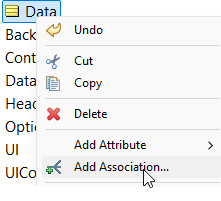

# Conference Registration Form

## Prerequisites: Getting the Project Files

Before you begin, this tutorial requires you to download two key assets from our GitHub repository:

1.  **The "Form Template" Rule Project**: The foundational project for creating dynamic forms.
2.  **The Front-End Renderer**: The HTML and JavaScript files needed to display the forms.

Follow these two steps to get everything you need.

### Step 1: Import the Rule Projects into Studio

We use a PowerShell script to automatically find and install all the sample rule projects, including the essential **"Form Template,"** into your Corticon.js Studio.

1.  **Navigate to the `sample-projects` Directory**:
    * Go to: [https://github.com/corticon/dynamic-forms/tree/main/sample-projects](https://github.com/corticon/dynamic-forms/tree/main/sample-projects)

2.  **Download the Import Script**:
    * In the file list, find and click on `Import-CorticonSamples.ps1`.
    * On the script's page, click the **Download raw file** button (the icon with a downward arrow).
    * Save the script to a convenient location, like your Desktop.


3.  **Run the Script**:
    * Open a PowerShell window, navigate to where you saved the file, and run it:
        ```powershell
        .\Import-CorticonSamples.ps1
        ```
    * This script will temporarily clone the `dynamic-forms` repository in the background, find all the samples, and install them into your Corticon.js Studio.

4.  **Restart Corticon.js Studio**:
    * After the script finishes, restart the studio. Go to **Help -> Samples** to find the **"Form Template"** project.

---

### Step 2: Get the Front-End Files

The front-end rendering application is in the `front-end-files` directory. We will use the `downgit` tool to download just this specific folder.

1.  **Download the Directory**:
    * Click this direct link to download the `front-end-files` directory as a ZIP file:
    * **[Download `front-end-files` using downgit](https://downgit.github.io/#/home?url=https://github.com/corticon/dynamic-forms/tree/main/front-end-files)**
    * This will download a file named `front-end-files.zip`.

2.  **Unzip the Files**:
    * Create a main project folder on your computer for this work (e.g., `C:\corticon-tutorial`).
    * Unzip the `front-end-files.zip` directly into that folder. Your folder structure should now look like this:
        ```
        C:\corticon-tutorial\
        └── front-end-files\
            ├── clientSideComponent\
            ├── decisionServices\
            ├── trace\
            └── index.html
            └── ... (and other files)
        ```

3.  **Important Note for Later**:
    * As you proceed through the tutorials, you will generate new Decision Services from Corticon.js Studio. **You must save these into the `decisionServices` subfolder.** For example: `C:\corticon-tutorial\front-end-files\decisionServices\`. This ensures the front-end application can find and load them.
    
---

## Tutorial: Building the Conference Form

Welcome to your first hands-on tutorial for building a dynamic form! In this guide, you will build a multi-stage conference registration form from scratch using the **Form Template** you just imported.

**What You Will Learn:**

* How to create a data model (Vocabulary) to store user information.
* How to build a form stage-by-stage using Rulesheets.
* How to ask the user questions using different UI controls like dropdowns, text fields, and checkboxes.
* How to create conditional logic, showing different questions based on the user's previous answers.

Let's get started!

---

## Step 1: Building the Vocabulary

First, we need to define the data model for our form. This is where we tell Corticon what information we plan to collect.

1.  In Corticon.js Studio, open the **Form Template** project you imported earlier.
2.  In the Project Explorer, open the `Rule Vocabulary.ecore` file.
3.  You will see the standard `UI`, `Container`, `UIControl`, and `Option` entities. We need to add one more to store our registrant's information.
4.  Expand the 'Data' folder in the rule vocabulary. Double click on the entity 'renameToYourPathToData', and enter **`Registrant`**.
5. Right click on the entity called 'Data' and click 'Add Association'.
   
      
   
6.  For the source entity name, keep 'Data.Data' for the the target entity name, select 'Data.Registrant', and click the 'One' button beneath it. Then, change 'Navigability' to 'Data.Data->Data.Registrant'.


7. Now, add attributes to the `Registrant` entity. Right-click the `Registrant` entity, select **Add New Attribute**, and create the following attributes one by one:

| Attribute Name             | Data Type |
| -------------------------- | --------- |
| `reg_level`                | String    |
| `first`                    | String    |
| `last`                     | String    |
| `email`                    | String    |
| `subscribed`               | Boolean   |
| `has_dietary_restrictions` | Boolean   |
| `lactose`                  | Boolean   |
| `Vegetarian`               | Boolean   |
| `Vegan`                    | Boolean   |
| `peanut`                   | Boolean   |
| `Diabetic`                 | Boolean   |
| `Kosher`                   | Boolean   |
| `Halal`                    | Boolean   |
| `requires_lodging`         | Boolean   |
| `requires_parking`         | Boolean   |
| `low_floor`                | Boolean   |
| `awayElevator`             | Boolean   |
| `nonSmoke`                 | Boolean   |
| `plateNo`                  | String    |
| `track`                    | String    |

6.  When you are finished, your `Registrant` entity should look like this. Save your vocabulary file.

---

## Step 2: Creating the Form Stages

Now we will create the rules for each stage of the form.

### Stage 0: Registration Level

This is the first screen the user sees. We will ask them to choose a registration package.

1.  Right-click your project and select **New > Rulesheet**. Name it `Stage0.ers`.
2.  In the **Preconditions** section, set the filter to `UI.currentStageNumber = 0`. This ensures these rules only run for the very first stage.
3.  In the Actions section, add the following rules:
    * **Rule 1 (Set Data Path):** Set `UI.pathToData` to the string `'registrant'`. This tells the form to store all collected data in our `Registrant` entity.
    * **Rule 2 (Create Container):** Set `UI.containers` to a `Container.new` with a `title` of `'Register'`.
    * **Rule 3 (Create Dropdown):** Add a `UIControl.new` to `UI.containers.uiControls`. Set its `type` to `'MultipleChoices'`, `fieldName` to `'reg_level'`, and `label` to `'Which package would you like to register for?'`.
    * **Rule 4, 5, 6 (Add Options):** Add three `Option.new` to `UI.containers.uiControls.option` to create the choices: 'Early Bird ($599)', 'Standard ($899)', and 'VIP ($1,199)'.
    * **Rule 7 (Set Next Stage):** Set `UI.nextStageNumber` to `1`.

### Stage 1: Registrant Info

Here, we collect the user's name and email.

1.  Create a new Rulesheet named `Stage1.ers`.
2.  Set the **Precondition** to `UI.currentStageNumber = 1`.
3.  Add the following rules in the Actions section:
    * **Rule 1 (Create Container):** Create a new `Container` with the `title` 'Registrant Info'.
    * **Rule 2, 3, 4 (Add Text Inputs):** Create three `UIControl.new` of `type` 'Text'. Set their `fieldName` attributes to `first`, `last`, and `email` respectively, and give them appropriate labels.
    * **Rule 5 (Add Checkbox):** Create a `UIControl.new` of `type` 'SingleChoice' with the `fieldName` `subscribed` and the label 'Keep me up to date...'.
    * **Rule 6 (Set Next Stage):** Set `UI.nextStageNumber` to `2`.

### Stage 2 & 3: Conditional Dietary Questions

This is a two-part stage. First, we ask a Yes/No question. Then, based on the answer, we either show more questions or skip ahead.

1.  **Create `Stage2.ers`** with precondition `UI.currentStageNumber = 2`.
    * This rulesheet will create a `MultipleChoices` control asking "Do you have any dietary restrictions?". The `fieldName` should be `has_dietary_restrictions`.
    * Add two `Option` entities for 'Yes' and 'No' with values of `true` and `false`.
    * Set `UI.nextStageNumber` to `3`.

2.  **Create `Stage3_Routing.ers`** with precondition `UI.currentStageNumber = 3`. This is a special non-visual stage.
    * Set `UI.noUiToRenderContinue` to `true`.
    * Create a **Conditional Rule**:
        * **Condition:** `Registrant.has_dietary_restrictions = true`
        * **Action:** `UI.nextStageNumber` = `4`
    * Create a second **Conditional Rule**:
        * **Condition:** `Registrant.has_dietary_restrictions = false`
        * **Action:** `UI.nextStageNumber` = `5`

### Stage 4: List Dietary Restrictions

This stage only shows if the user answered "Yes" in stage 2.

1.  **Create `Stage4.ers`** with precondition `UI.currentStageNumber = 4`.
2.  Create a container titled 'Meal Reqs.'.
3.  Create multiple `SingleChoice` (checkbox) controls for each dietary need (`lactose`, `Vegan`, `peanut`, etc.).
4.  Set `UI.nextStageNumber` to `5`.

...and so on for the remaining stages, following the logic in the ruleflow report to create rulesheets for lodging questions (Stages 5, 6, 7) and the final conference track selection (Stage 8). In the final stage, you will set `UI.done` to `true`.

---

## Step 3: Assembling the Ruleflow

For this project, the stage progression is handled by rules, not by connecting rulesheets.

1.  Create a **New > Ruleflow** named `FormFlow.erf`.
2.  Drag **all** of your rulesheets onto the canvas.
3.  **Do not connect them.** The `currentStageNumber` precondition on each sheet ensures they fire at the correct time.

---

## Step 4: Testing Your Logic

Use the Ruletester in Studio to check your work.

1.  Open the Ruletester view.
2.  **Test Case 1 (Initial Load):**
    * **Input:** Create a `UI` object with `currentStageNumber = 0`.
    * **Expected Output:** The `UI` object should now have `nextStageNumber = 1` and UI controls for the registration level dropdown.
3.  **Test Case 2 (Dietary Path):**
    * **Input:** Create a `UI` object with `currentStageNumber = 3` and a `Registrant` object with `has_dietary_restrictions = true`.
    * **Expected Output:** The `UI` object should have `nextStageNumber = 4`.
4.  **Test Case 3 (No Dietary Path):**
    * **Input:** Create a `UI` object with `currentStageNumber = 3` and a `Registrant` object with `has_dietary_restrictions = false`.
    * **Expected Output:** The `UI` object should have `nextStageNumber = 5`.

---

## Conclusion

Congratulations! You have successfully built the logic for a complex, multi-stage dynamic form. You have learned how to model data, create UI controls with rules, and guide a user through a conditional path. The final step would be to compile this project into a Decision Service for the front-end team.