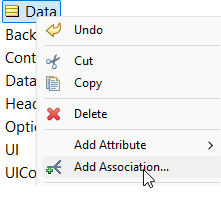

# Homeowner's Insurance Application

## Prerequisites: Getting the Project Files

Before you begin, this tutorial requires you to download two key assets from our GitHub repository:

1.  **The "Form Template" Rule Project**: The foundational project for creating dynamic forms.
2.  **The Front-End Renderer**: The HTML and JavaScript files needed to display the forms.

Follow these two steps to get everything you need.

### Step 1: Import the Rule Projects into Studio

We use a PowerShell script to automatically find and install all the sample rule projects, including the essential **"Form Template,"** into your Corticon.js Studio.

1.  **Navigate to the `sample-projects` Directory**:
    * Go to: [https://github.com/corticon/dynamic-forms/tree/main/sample-projects](https://github.com/corticon/dynamic-forms/tree/main/sample-projects)

2.  **Download the Import Script**:
    * In the file list, find and click on `Import-CorticonSamples.ps1`.
    * On the script's page, click the **Download raw file** button (the icon with a downward arrow).
    * Save the script to a convenient location, like your Desktop.

3.  **Run the Script**:
    * Open a PowerShell window, navigate to where you saved the file, and run it:
        ```powershell
        .\Import-CorticonSamples.ps1
        ```
    * This script will temporarily clone the `dynamic-forms` repository in the background, find all the samples, and install them into your Corticon.js Studio.

4.  **Restart Corticon.js Studio**:
    * After the script finishes, restart the studio. Go to **Help -> Samples** to find the **"Form Template"** project.

---

### Step 2: Get the Front-End Files

The front-end rendering application is in the `front-end-files` directory. We will use the `downgit` tool to download just this specific folder.

1.  **Download the Directory**:
    * Click this direct link to download the `front-end-files` directory as a ZIP file:
    * **[Download `front-end-files` using downgit](https://downgit.github.io/#/home?url=https://github.com/corticon/dynamic-forms/tree/main/front-end-files)**
    * This will download a file named `front-end-files.zip`.

2.  **Unzip the Files**:
    * Create a main project folder on your computer for this work (e.g., `C:\corticon-tutorial`).
    * Unzip the `front-end-files.zip` directly into that folder. Your folder structure should now look like this:
        ```
        C:\corticon-tutorial\
        └── front-end-files\
            ├── clientSideComponent\
            ├── decisionServices\
            ├── trace\
            └── index.html
            └── ... (and other files)
        ```

3.  **Important Note for Later**:
    * As you proceed through the tutorials, you will generate new Decision Services from Corticon.js Studio. **You must save these into the `decisionServices` subfolder.** For example: `C:\corticon-tutorial\front-end-files\decisionServices\`. This ensures the front-end application can find and load them.

---

## Tutorial: Building the Homeowner's Insurance Application

In this tutorial, you will build a practical, multi-stage application form for a homeowner's insurance policy. This project is a perfect example of how dynamic forms can handle complex data collection and even perform calculations.

**What You Will Learn:**

* How to model a more complex vocabulary for an insurance application.
* How to build a linear, multi-page form.
* How to use rules to perform a premium calculation based on user input.
* How to display the results of a calculation on a final summary screen.

---

## Step 1: Building the Vocabulary

First, we will define the data model for our insurance application.

1.  In Corticon.js Studio, open the **Form Template** project you imported earlier.
2.  In the Project Explorer, open the `Rule Vocabulary.ecore` file.
3. Expand the 'Data' folder in the rule vocabulary. Double click on the entity 'renameToYourPathToData', and enter **`Homeowners`**.
4. Right click on the entity called 'Data' and click 'Add Association'.
   
      
   
5.  For the source entity name, keep 'Data.Data' for the the target entity name, select 'Data.Homeowners', and click the 'One' button beneath it. Then, change 'Navigability' to 'Data.Data->Data.Homeowners'.


6.  Now, add the following attributes to your new `Homeowners` entity. This will store all the information about the applicant, their property, and the final quote.

| Attribute Name   | Data Type |
| ---------------- | --------- |
| `fullName`       | String    |
| `street`         | String    |
| `city`           | String    |
| `state`          | String    |
| `zipCode`        | String    |
| `propertyType`   | String    |
| `yearBuilt`      | Integer   |
| `construction`   | String    |
| `roofType`       | String    |
| `securitySystem` | Boolean   |
| `swimmingPool`   | Boolean   |
| `fireSuppress`   | Boolean   |
| `coverageAmount` | Decimal   |
| `deductible`     | Decimal   |
| `premium`        | Decimal   |

7.  Save your vocabulary file.

---

## Step 2: Creating the Form Stages

We will now create a series of rulesheets to guide the user through the application process.

### Stage 0: Applicant Information

This stage collects basic information about the person applying.

1.  Create a **New > Rulesheet** named `Stage0_Applicant.ers`.
2.  Set the **Precondition** to `UI.currentStageNumber = 0`.
3.  In the Actions section, add the following rules:
    * **Set Data Path:** `UI.pathToData` = `'Homeowners'`
    * **Create Container:** `UI.containers` = `Container.new` with a `title` of `'Applicant Information'`.
    * **Add Text Inputs:** Create four `UIControl.new` of `type` 'Text' for the applicant's full name and address. Link them to the vocabulary using the `fieldName` attribute for each (`fullName`, `street`, `city`, etc.).
    * **Set Next Stage:** `UI.nextStageNumber` = `1`

### Stage 1: Property Information

This stage gathers details about the home to be insured.

1.  Create a **New > Rulesheet** named `Stage1_Property.ers`.
2.  Set the **Precondition** to `UI.currentStageNumber = 1`.
3.  Add the following rules:
    * **Create Container:** `UI.containers` = `Container.new` with a `title` of `'Property Information'`.
    * **Add Dropdowns:** Create `UIControl.new` of `type` 'MultipleChoices' for `propertyType`, `construction`, and `roofType`. For each one, add `Option.new` entities to provide choices (e.g., for `propertyType`, add options for 'Single Family Home', 'Townhouse', 'Condo').
    * **Add Number Input:** Create a `UIControl.new` of `type` 'Number' for `yearBuilt`.
    * **Add Checkboxes:** Create three `UIControl.new` of `type` 'SingleChoice' for `securitySystem`, `swimmingPool`, and `fireSuppress`.
    * **Set Next Stage:** `UI.nextStageNumber` = `2`

### Stage 2: Coverage Information

Here, the user selects their desired coverage levels.

1.  Create a **New > Rulesheet** named `Stage2_Coverage.ers`.
2.  Set the **Precondition** to `UI.currentStageNumber = 2`.
3.  Add the following rules:
    * **Create Container:** `UI.containers` = `Container.new` with a `title` of `'Coverage Details'`.
    * **Add Number Inputs:** Create two `UIControl.new` of `type` 'Number'. One for `coverageAmount` and one for `deductible`.
    * **Set Next Stage:** `UI.nextStageNumber` = `3`

### Stage 3: Calculate Quote (Non-Visual)

This special stage performs the premium calculation in the background without showing anything to the user.

1.  Create a **New > Rulesheet** named `Stage3_Calculate.ers`.
2.  Set the **Precondition** to `UI.currentStageNumber = 3`.
3.  Add the following rules:
    * **Enable Background Processing:** `UI.noUiToRenderContinue` = `true`.
    * **Base Premium Rule:** In the Actions, set `Homeowners.premium` = `Homeowners.coverageAmount * 0.005`. This sets a base premium.
    * **Add Surcharge Rules:** Create several **Conditional Rules**. For example:
        * **Condition:** `Homeowners.swimmingPool = true`
        * **Action:** `Homeowners.premium += 150`
        * **Condition:** `Homeowners.roofType = 'Wood Shake'`
        * **Action:** `Homeowners.premium += 200`
    * **Add Discount Rules:** Create conditional rules for discounts:
        * **Condition:** `Homeowners.securitySystem = true`
        * **Action:** `Homeowners.premium -= 75`
    * **Set Next Stage:** `UI.nextStageNumber` = `4`

### Stage 4: Display Quote

This final stage displays the calculated premium to the user.

1.  Create a **New > Rulesheet** named `Stage4_Quote.ers`.
2.  Set the **Precondition** to `UI.currentStageNumber = 4`.
3.  Add the following rules:
    * **Create Container:** `UI.containers` = `Container.new` with a `title` of `'Your Quote'`.
    * **Display Premium:** Create a `UIControl.new` of `type` 'ReadOnlyText'. Set its `value` to the string `'Your calculated annual premium is: $' + Homeowners.premium`.
    * **End the Form:** `UI.done` = `true`.

---

## Step 3: Assembling the Ruleflow

Just like our first tutorial, we will let the rules handle the flow.

1.  Create a **New > Ruleflow** named `Homeowners.erf`.
2.  Drag all five of your rulesheets (`Stage0` through `Stage4`) onto the canvas.
3.  **Do not connect them.** The `currentStageNumber` precondition on each sheet will control the execution order.

---

## Step 4: Testing Your Logic

Use the Ruletester to verify your calculations.

1.  **Test Case 1 (Premium Calculation):**
    * **Input:** Create a `UI` object with `currentStageNumber = 3`. Create a `Homeowners` object with values like `coverageAmount = 300000`, `swimmingPool = true`, and `securitySystem = true`.
    * **Expected Output:** The `UI` object should have `nextStageNumber = 4`. The `Homeowners.premium` should be calculated correctly (e.g., (300000 * 0.005) + 150 - 75 = 1575).

---

## Conclusion

Great job! You have now built a complete insurance application form that not only collects data across multiple stages but also uses conditional logic to perform calculations and display a result. You are well on your way to mastering dynamic form creation.