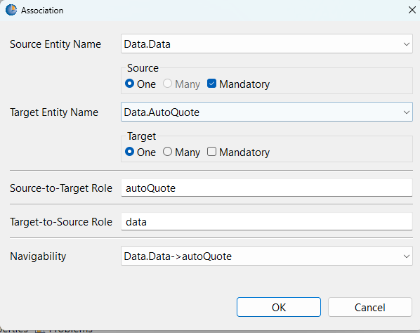

# Tutorial 3: Data-Driven Vehicle Selection

## Prerequisites: Getting the Project Files

Before you begin, this tutorial requires you to download two key assets from our GitHub repository:

1.  **The "Form Template" Rule Project**: The foundational project for creating dynamic forms.
2.  **The Front-End Renderer**: The HTML and JavaScript files needed to display the forms.

Follow these two steps to get everything you need.

### Step 1: Import the Rule Projects into Studio

We use a PowerShell script to automatically find and install all the sample rule projects, including the essential **"Form Template,"** into your Corticon.js Studio.

1.  **Navigate to the `sample-projects` Directory**:
    * Go to: [https://github.com/corticon/dynamic-forms/tree/main/sample-projects](https://github.com/corticon/dynamic-forms/tree/main/sample-projects)

2.  **Download the Import Script**:
    * In the file list, find and click on `Import-CorticonSamples.ps1`.
    * On the script's page, click the **Download raw file** button (the icon with a downward arrow).
    * Save the script to a convenient location, like your Desktop.

3.  **Run the Script**:
    * Open a PowerShell window, navigate to where you saved the file, and run it:
        ```powershell
        .\Import-CorticonSamples.ps1
        ```
    * This script will temporarily clone the `dynamic-forms` repository in the background, find all the samples, and install them into your Corticon.js Studio.

4.  **Restart Corticon.js Studio**:
    * After the script finishes, restart the studio. Go to **Help -> Samples** to find the **"Form Template"** project.

---

### Step 2: Get the Front-End Files

The front-end rendering application is in the `front-end-files` directory. We will use the `downgit` tool to download just this specific folder.

1.  **Download the Directory**:
    * Click this direct link to download the `front-end-files` directory as a ZIP file:
    * **[Download `front-end-files` using downgit](https://downgit.github.io/#/home?url=https://github.com/corticon/dynamic-forms/tree/main/front-end-files)**
    * This will download a file named `front-end-files.zip`.

2.  **Unzip the Files**:
    * Create a main project folder on your computer for this work (e.g., `C:\corticon-tutorial`).
    * Unzip the `front-end-files.zip` directly into that folder. Your folder structure should now look like this:
        ```
        C:\corticon-tutorial\
        └── front-end-files\
            ├── clientSideComponent\
            ├── decisionServices\
            ├── trace\
            └── index.html
            └── ... (and other files)
        ```

3.  **Important Note for Later**:
    * As you proceed through the tutorials, you will generate new Decision Services from Corticon.js Studio. **You must save these into the `decisionServices` subfolder.** For example: `C:\corticon-tutorial\front-end-files\decisionServices\`. This ensures the front-end application can find and load them.

---

## Tutorial: Building the Data-Driven Vehicle Selection Form

In this tutorial, you will build a dynamic vehicle selection form. What makes this project special is that the dropdown menus for vehicle makes and models will be populated dynamically by calling an external REST API. This is a powerful technique for forms that rely on data from other systems.

**What You Will Learn:**

* How to use the `dataSource` attribute to populate a dropdown from a URL.
* How to use `DataSourceOptions` to map data from a JSON response to your dropdown's display text and value.
* How to create cascading dropdowns, where the selection in one dropdown filters the options in another.

---

## Step 1: Building the Vocabulary

First, we'll define the data model. This form only needs to store the user's final selections.

1.  In Corticon.js Studio, open the **Form Template** project you imported earlier.
2.  In the Project Explorer, open the `Rule Vocabulary.ecore` file.
3. Expand the 'Data' folder in the rule vocabulary. Double click on the entity 'renameToYourPathToData', and enter **`AutoQuote`**.
4. Right click on the entity called 'Data' and click 'Add Association'.
   
      
   
5.  For the source entity name, keep 'Data.Data' for the the target entity name, select 'Data.AutoQuote', and click the 'One' button beneath it. Then, change 'Navigability' to 'Data.Data->Data.AutoQuote'.


4.  Add the following attributes to the `AutoQuote` entity:

| Attribute Name  | Data Type |
| :-------------- | :-------- |
| `vehicle_make`  | String    |
| `vehicle_model` | String    |
| `vehicle_year`  | Integer   |

5.  Save your vocabulary file.

---

## Step 2: Creating the Form Stages

This form has three primary stages: selecting the make, the model, and the year.

### Stage 0: Select Vehicle Make

This first stage will call an external API to get a list of vehicle makes.

1.  Create a **New > Rulesheet** named `Stage0_Make.ers`.
2.  Set the **Precondition** to `UI.currentStageNumber = 0`.
3.  In the Actions section, add the following rules:
    * **Set Data Path:** `UI.pathToData` = `'AutoQuote'`
    * **Create Container:** `UI.containers` = `Container.new` with a `title` of `'Select Vehicle'`.
    * **Create Make Dropdown:** Add a `UIControl.new` to `UI.containers.uiControls`.
        * `type` = `'MultipleChoices'`
        * `fieldName` = `'vehicle_make'`
        * `label` = `'Please select the make of the vehicle'`
        * `dataSource` = `'https://api.npoint.io/d487567c8a34a506350e'` (This is our mock API endpoint)
    * **Configure DataSource Mapping:** Because our API uses different key names, we need to map them. Add a `DataSourceOptions.new` to the dropdown control you just created.
        * `dataValueField` = `'brand'`
        * `dataTextField` = `'brand'`
    * **Set Next Stage:** `UI.nextStageNumber` = `1`

### Stage 1: Select Vehicle Model

This stage is similar, but the URL it calls will be dynamic, including the make selected in the previous stage.

1.  Create a **New > Rulesheet** named `Stage1_Model.ers`.
2.  Set the **Precondition** to `UI.currentStageNumber = 1`.
3.  Add the following rules:
    * **Create Container:** `UI.containers` = `Container.new` with a `title` of `'Select Vehicle'`.
    * **Create Model Dropdown:** Add a `UIControl.new` to `UI.containers.uiControls`.
        * `type` = `'MultipleChoices'`
        * `fieldName` = `'vehicle_model'`
        * `label` = `'Please select the model'`
        * `dataSource` = `'https://api.npoint.io/d487567c8a34a506350e'`
    * **Configure DataSource Mapping and Filtering:** Add a `DataSourceOptions.new` to the model dropdown.
        * `dataValueField` = `'name'`
        * `dataTextField` = `'name'`
        * `pathToOptionsArray` = `$.[?(@.brand == '` + AutoQuote.vehicle_make + `')].models[*]`
        * **Note:** This JSONPath expression is the key. It filters the results from the API, only showing the models where the `brand` matches the `vehicle_make` the user already selected.
    * **Set Next Stage:** `UI.nextStageNumber` = `2`

### Stage 2: Select Vehicle Year and Finish

This is the final stage where the user selects the year.

1.  Create a **New > Rulesheet** named `Stage2_Year.ers`.
2.  Set the **Precondition** to `UI.currentStageNumber = 2`.
3.  Add the following rules:
    * **Create Container:** `UI.containers` = `Container.new` with a `title` of `'Select Vehicle'`.
    * **Create Year Input:** Add a `UIControl.new` of `type` 'Number' with the `fieldName` `'vehicle_year'` and an appropriate label.
    * **End the Form:** `UI.done` = `true`.

---

## Step 3: Assembling the Ruleflow

1.  Create a **New > Ruleflow** named `Select-Vehicle.erf`.
2.  Drag all three of your rulesheets onto the canvas.
3.  **Do not connect them.** The stage progression is handled entirely by the `nextStageNumber` attributes set in your rules.

---

## Step 4: Testing Your Logic

Testing this ruleflow involves checking that the `dataSource` and `pathToOptionsArray` are being set correctly.

1.  **Test Case 1 (Initial Load):**
    * **Input:** `UI` object with `currentStageNumber = 0`.
    * **Expected Output:** The `UI` object should have a `UIControl` for the vehicle make, and its `dataSource` and `dataSourceOptions` attributes should be set correctly. `nextStageNumber` should be `1`.
2.  **Test Case 2 (Model Selection):**
    * **Input:** `UI` object with `currentStageNumber = 1`. Create an `AutoQuote` object with `vehicle_make = 'Ford'`.
    * **Expected Output:** The `UI` object should have a `UIControl` for the vehicle model. Its `pathToOptionsArray` should now contain the string `$.[?(@.brand == 'Ford')].models[*]`, demonstrating that the path is being dynamically constructed.

---

## Conclusion

Congratulations! You've now built a sophisticated form that fetches its options from an external API and uses cascading logic to filter choices. This is a very common pattern in real-world applications and a powerful skill to have.